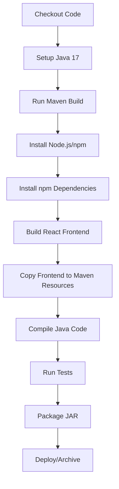

# Development Guide

This document explains how to work with the QQQ Frontend Material Dashboard repository for both local development and CI/CD pipelines.

## 📋 Table of Contents

- [Project Overview](#project-overview)
- [Local Development](#local-development)
- [CI/CD Pipeline](#cicd-pipeline)
- [Build Process](#build-process)
- [Troubleshooting](#troubleshooting)
- [Best Practices](#best-practices)

## 🏗️ Project Overview

This repository contains a **hybrid Maven + React project** that combines:
- **Frontend**: React 18 + TypeScript + Material-UI dashboard
- **Backend**: Java 17 + Maven for packaging and distribution
- **Integration**: Maven builds the React frontend and packages it with Java code

### Architecture

```
┌─────────────────────────────────────────────────────────────┐
│                    QQQ Frontend Material Dashboard          │
├─────────────────────────────────────────────────────────────┤
│  Frontend (React/TypeScript)    │  Backend (Java/Maven)     │
│  ├── src/                       │  ├── src/main/java/       │
│  │   ├── App.tsx                │  │   └── com/kingsrook/    │
│  │   ├── qqq/                   │  └── pom.xml              │
│  │   └── ...                    │                           │
│  ├── package.json               │  Maven Plugins:           │
│  └── tsconfig.json              │  ├── frontend-maven-plugin │
│                                  │  ├── maven-resources-plugin│
│                                  │  └── maven-jar-plugin     │
└─────────────────────────────────────────────────────────────┘
```

## 🚀 Local Development

### Prerequisites

- **Node.js**: 18.x LTS or higher
- **npm**: 9.x or higher  
- **Java**: 17 or higher
- **Maven**: 3.8+ (optional for frontend-only development)

### Quick Start

1. **Clone the repository**
   ```bash
   git clone https://github.com/Kingsrook/qqq-frontend-material-dashboard.git
   cd qqq-frontend-material-dashboard
   ```

2. **Install dependencies**
   ```bash
   npm run install:legacy
   ```

3. **Start development server**
   ```bash
   npm start
   ```

4. **Open browser**
   Navigate to `http://localhost:3000`

### Development Workflows

#### Frontend-Only Development

For UI development, you typically only need the React frontend:

```bash
# Install dependencies
npm run install:legacy

# Start development server with hot reloading
npm start

# Run tests
npm test

# Run linting
npm run lint
npm run lint:fix

# Type checking
npm run type-check

# Build for production
npm run build
```

#### Full-Stack Development

When you need to work with both frontend and backend:

```bash
# Build everything (frontend + backend)
mvn clean package

# Run only the frontend build
mvn clean compile

# Run tests (both frontend and backend)
mvn test

# Build with specific profile
mvn clean package -Pci
```

### Available Scripts

| Script | Purpose | When to Use |
|--------|---------|-------------|
| `npm start` | Start React dev server | Frontend development |
| `npm run dev` | Alias for start | Frontend development |
| `npm run build` | Build React for production | Before deployment |
| `npm test` | Run Jest tests | Testing |
| `npm run test:ci` | Run tests for CI | CI/CD pipelines |
| `npm run test:coverage` | Run tests with coverage | Code quality |
| `npm run lint` | Check code quality | Code review |
| `npm run lint:fix` | Auto-fix linting issues | Code cleanup |
| `npm run type-check` | Validate TypeScript | Type safety |
| `npm run clean` | Clean build artifacts | Troubleshooting |
| `npm run install:legacy` | Install with legacy peer deps | Initial setup |

### Development Best Practices

1. **Use npm scripts for frontend development**
   ```bash
   npm start    # For development
   npm test     # For testing
   npm run lint # For code quality
   ```

2. **Use Maven for full builds**
   ```bash
   mvn clean package  # For complete builds
   ```

3. **Run type checking before commits**
   ```bash
   npm run type-check
   npm run lint
   ```

4. **Test both frontend and backend**
   ```bash
   npm test     # Frontend tests
   mvn test     # Backend tests
   ```

## 🔄 CI/CD Pipeline

### Overview

The CI/CD pipeline uses **Maven as the single build tool** that handles both frontend and backend compilation. This approach provides:

- ✅ **Single build command**: `mvn clean package`
- ✅ **Consistent environments**: Maven manages Node.js/npm versions
- ✅ **Atomic builds**: Either everything succeeds or everything fails
- ✅ **No external dependencies**: CI/CD only needs Java

### NPM Peer Dependency Configuration

This project uses `--legacy-peer-deps` due to peer dependency conflicts between:
- **@types/react**: `18.0.0` (React 18)
- **@mui/icons-material**: `5.4.1` (expects React 16-17)

When using the QQQ GitHub Actions library, configure it to handle these conflicts:

```yaml
with:
  npm-use-legacy-peer-deps: 'true'  # Handle peer dependency conflicts
```

### Pipeline Steps



### CI/CD Configuration

#### GitHub Actions Example (Using QQQ Actions Library)

```yaml
name: 'CI/CD Pipeline'

on:
  push:
    branches: [main, develop, 'release/**', 'hotfix/**', 'feature/**']
  pull_request:
    branches: [main, develop]

jobs:
  test:
    uses: Kingsrook/github-actions-library/.github/workflows/reusable-gitflow-test@main
    with:
      project-type: 'hybrid'
      java-version: '17'
      node-version: '18'
      npm-use-legacy-peer-deps: 'true'  # Handle peer dependency conflicts
    secrets:
      GITHUB_TOKEN: ${{ secrets.GITHUB_TOKEN }}

  snapshot:
    uses: Kingsrook/github-actions-library/.github/workflows/reusable-gitflow-snapshot@main
    with:
      project-type: 'hybrid'
      java-version: '17'
      node-version: '18'
      npm-use-legacy-peer-deps: 'true'  # Handle peer dependency conflicts
    secrets:
      GITHUB_TOKEN: ${{ secrets.GITHUB_TOKEN }}
      GPG_PRIVATE_KEY_B64: ${{ secrets.GPG_PRIVATE_KEY_B64 }}
      GPG_KEYNAME: ${{ secrets.GPG_KEYNAME }}
      GPG_PASSPHRASE: ${{ secrets.GPG_PASSPHRASE }}
      CENTRAL_USERNAME: ${{ secrets.CENTRAL_USERNAME }}
      CENTRAL_PASSWORD: ${{ secrets.CENTRAL_PASSWORD }}
      NPM_TOKEN: ${{ secrets.NPM_TOKEN }}

  release:
    uses: Kingsrook/github-actions-library/.github/workflows/reusable-gitflow-release@main
    with:
      project-type: 'hybrid'
      java-version: '17'
      node-version: '18'
      npm-use-legacy-peer-deps: 'true'  # Handle peer dependency conflicts
    secrets:
      GITHUB_TOKEN: ${{ secrets.GITHUB_TOKEN }}
      GPG_PRIVATE_KEY_B64: ${{ secrets.GPG_PRIVATE_KEY_B64 }}
      GPG_KEYNAME: ${{ secrets.GPG_KEYNAME }}
      GPG_PASSPHRASE: ${{ secrets.GPG_PASSPHRASE }}
      CENTRAL_USERNAME: ${{ secrets.CENTRAL_USERNAME }}
      CENTRAL_PASSWORD: ${{ secrets.CENTRAL_PASSWORD }}
      NPM_TOKEN: ${{ secrets.NPM_TOKEN }}
```

#### Manual GitHub Actions Example

```yaml
name: Build and Test

on:
  push:
    branches: [ main, develop ]
  pull_request:
    branches: [ main ]

jobs:
  build:
    runs-on: ubuntu-latest
    
    steps:
    - name: Checkout code
      uses: actions/checkout@v3
      
    - name: Set up JDK 17
      uses: actions/setup-java@v3
      with:
        java-version: '17'
        distribution: 'temurin'
        
    - name: Cache Maven dependencies
      uses: actions/cache@v3
      with:
        path: ~/.m2
        key: ${{ runner.os }}-m2-${{ hashFiles('**/pom.xml') }}
        
    - name: Build with Maven
      run: mvn clean package -Pci
      # Maven automatically:
      # 1. Downloads Node.js v18.17.0
      # 2. Installs npm dependencies with --legacy-peer-deps
      # 3. Builds React frontend
      # 4. Compiles Java code
      # 5. Packages everything into JAR
      
    - name: Run tests
      run: mvn test
      
    - name: Upload build artifacts
      uses: actions/upload-artifact@v3
      with:
        name: qqq-frontend-material-dashboard
        path: target/*.jar
```

#### Jenkins Example

```groovy
pipeline {
    agent any
    
    tools {
        jdk '17'
    }
    
    stages {
        stage('Checkout') {
            steps {
                checkout scm
            }
        }
        
        stage('Build') {
            steps {
                sh 'mvn clean package -Pci'
            }
        }
        
        stage('Test') {
            steps {
                sh 'mvn test'
            }
        }
        
        stage('Archive') {
            steps {
                archiveArtifacts artifacts: 'target/*.jar', fingerprint: true
            }
        }
    }
}
```

### Maven Profiles

The project includes different profiles for different environments:

#### `ci` Profile
```bash
mvn clean package -Pci
```
- Optimized for CI/CD environments
- Uses specific Node.js/npm versions
- Minimal logging for faster builds

#### `release` Profile
```bash
mvn clean package -Prelease
```
- Includes source and javadoc generation
- GPG signing for Maven Central
- Full artifact publishing

#### Default Profile
```bash
mvn clean package
```
- Standard development build
- Includes all plugins and configurations

## 🔧 Build Process

### How Maven Builds the Project

The build process is orchestrated by Maven plugins:

#### 1. Frontend Maven Plugin
```xml
<plugin>
   <groupId>com.github.eirslett</groupId>
   <artifactId>frontend-maven-plugin</artifactId>
   <executions>
      <!-- Downloads Node.js v18.17.0 -->
      <execution>
         <id>install-node-and-npm</id>
         <goals><goal>install-node-and-npm</goal></goals>
      </execution>
      
      <!-- Runs: npm install --legacy-peer-deps -->
      <execution>
         <id>npm-install</id>
         <goals><goal>npm</goal></goals>
      </execution>
      
      <!-- Runs: npm run build -->
      <execution>
         <id>npm-build</id>
         <goals><goal>npm</goal></goals>
      </execution>
   </executions>
</plugin>
```

#### 2. Maven Resources Plugin
```xml
<plugin>
   <groupId>org.apache.maven.plugins</groupId>
   <artifactId>maven-resources-plugin</artifactId>
   <executions>
      <!-- Copies build/ to target/classes/static/ -->
      <execution>
         <id>copy-frontend-build</id>
         <phase>process-resources</phase>
         <goals><goal>copy-resources</goal></goals>
      </execution>
   </executions>
</plugin>
```

### Build Output

After running `mvn clean package`, you get:

```
target/
├── classes/
│   ├── com/kingsrook/qqq/          # Compiled Java classes
│   └── static/                     # React build output
│       ├── index.html
│       ├── static/css/
│       └── static/js/
├── qqq-frontend-material-dashboard-0.26.0-SNAPSHOT.jar
└── qqq-frontend-material-dashboard-0.26.0-SNAPSHOT-tests.jar
```

### Build Phases

1. **Clean**: Remove previous build artifacts
2. **Validate**: Verify project structure
3. **Initialize**: Set up build environment
4. **Generate Sources**: Create any generated code
5. **Process Resources**: Copy static resources
6. **Compile**: Compile Java source code
7. **Process Test Resources**: Copy test resources
8. **Test Compile**: Compile test code
9. **Test**: Run unit tests
10. **Package**: Create JAR file
11. **Verify**: Run integration tests
12. **Install**: Install to local repository
13. **Deploy**: Deploy to remote repository

## 🐛 Troubleshooting

### Common Issues

#### 1. Node.js/npm Version Conflicts
```bash
# Problem: Different Node.js versions between environments
# Solution: Maven manages Node.js versions automatically

# Check what Maven is using:
mvn help:effective-pom | grep nodeVersion
```

#### 2. Peer Dependency Issues
```bash
# Problem: npm install fails with peer dependency conflicts
# Solution: Use the legacy peer deps flag

npm run install:legacy
# or
npm install --legacy-peer-deps
```

**For CI/CD**: Configure the GitHub Actions library to handle peer dependencies:
```yaml
with:
  npm-use-legacy-peer-deps: 'true'
```

#### 3. Build Failures
```bash
# Problem: Maven build fails
# Solution: Clean and rebuild

mvn clean
mvn clean package
```

#### 4. Frontend Not Updating
```bash
# Problem: Frontend changes not reflected
# Solution: Clean frontend build

npm run clean
npm run install:legacy
npm run build
```

#### 5. TypeScript Errors
```bash
# Problem: TypeScript compilation errors
# Solution: Check types and fix issues

npm run type-check
npm run lint:fix
```

### Debug Commands

```bash
# Check Maven effective POM
mvn help:effective-pom

# Check Maven dependencies
mvn dependency:tree

# Run Maven with debug output
mvn clean package -X

# Check Node.js version used by Maven
mvn frontend:install-node-and-npm -X

# Verify frontend build
ls -la build/
ls -la target/classes/static/
```

### Environment Variables

For development, you may need these environment variables:

```bash
# Frontend development
export BROWSER=none                    # Prevent auto-browser opening
export REACT_APP_API_BASE_URL=...      # Backend API URL
export REACT_APP_WS_BASE_URL=...       # WebSocket URL

# Maven build
export MAVEN_OPTS="-Xmx2048m"         # Increase Maven memory
export JAVA_HOME=/path/to/java17      # Java home directory
```

## 📚 Best Practices

### Development Workflow

1. **Start with frontend development**
   ```bash
   npm start  # Quick iteration
   ```

2. **Test frequently**
   ```bash
   npm test           # Frontend tests
   npm run type-check # Type safety
   npm run lint       # Code quality
   ```

3. **Build before committing**
   ```bash
   npm run build      # Frontend build
   mvn clean package  # Full build
   ```

4. **Use Maven for CI/CD**
   ```bash
   mvn clean package -Pci  # CI/CD builds
   ```

### Code Quality

1. **Run linting before commits**
   ```bash
   npm run lint:fix
   ```

2. **Ensure type safety**
   ```bash
   npm run type-check
   ```

3. **Test both frontend and backend**
   ```bash
   npm test  # Frontend
   mvn test  # Backend
   ```

### Performance

1. **Use development mode for frontend**
   ```bash
   npm start  # Fast development builds
   ```

2. **Use production builds for testing**
   ```bash
   npm run build  # Optimized builds
   ```

3. **Cache dependencies in CI/CD**
   ```yaml
   # Cache Maven dependencies
   - uses: actions/cache@v3
     with:
       path: ~/.m2
       key: ${{ runner.os }}-m2-${{ hashFiles('**/pom.xml') }}
   ```

### Security

1. **Use specific versions**
   - Node.js: v18.17.0 (managed by Maven)
   - npm: v9.6.7 (managed by Maven)
   - Java: 17 (specified in pom.xml)

2. **Keep dependencies updated**
   ```bash
   npm audit
   npm audit fix
   ```

3. **Use environment variables for secrets**
   ```bash
   export REACT_APP_API_KEY=...
   ```

## 📞 Support

For issues and questions:

- **Main Repository**: https://github.com/Kingsrook/qqq
- **Issues**: https://github.com/Kingsrook/qqq/issues
- **Documentation**: https://github.com/Kingsrook/qqq.wiki
- **Email**: contact@kingsrook.com

---

**This is a component of the QQQ framework. For complete information, visit: https://github.com/Kingsrook/qqq**